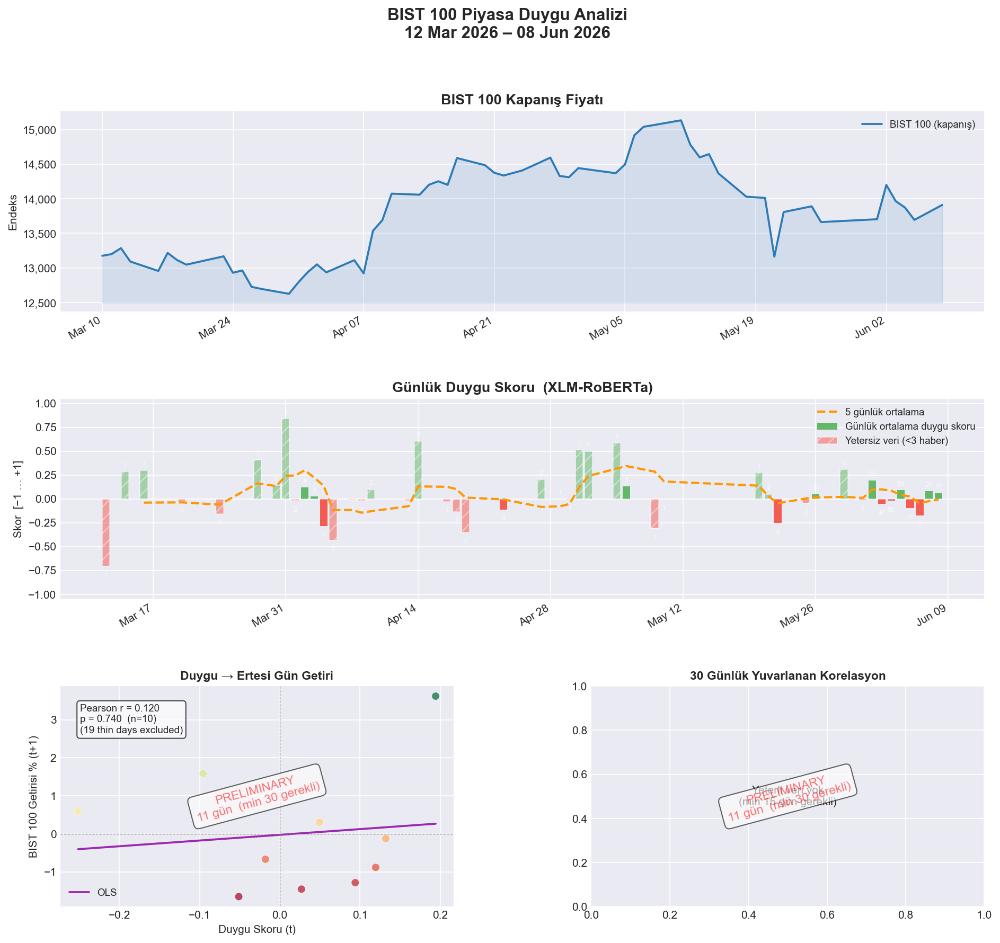
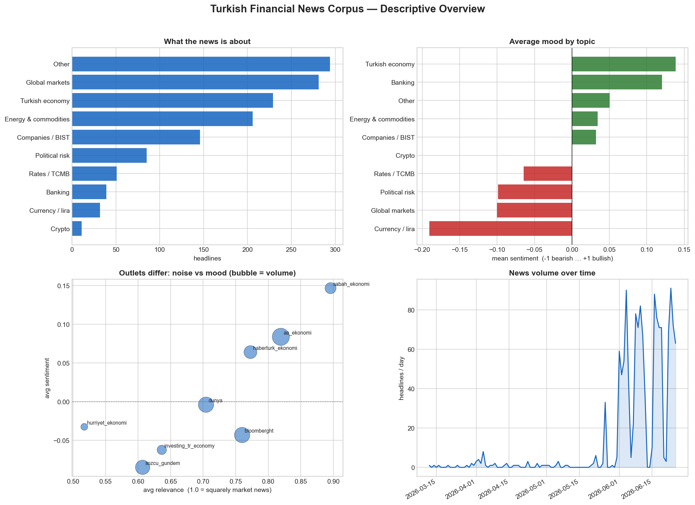
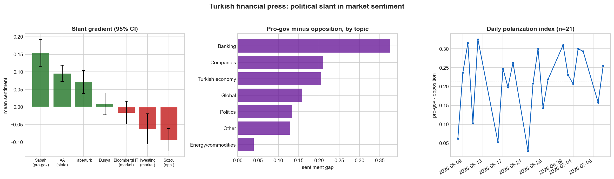

# BIST 100 Turkish News Sentiment Pipeline


Every weekday this project reads Turkish financial news, scores each headline's market sentiment with a language model, and tracks whether that daily "mood" has any power to predict the next day's move in the **BIST 100** — Istanbul's main stock index.

> **Research question:** Does the sentiment of Turkish financial news on day *t* predict the direction of BIST 100 on day *t+1*?

I built it as a portfolio project — somewhere to do empirical work the careful way and stay honest about what is actually known versus merely hoped. **The code is mostly AI-written (Claude Code); the research design, the methodology, the validation discipline, and the judgment calls are mine.** Where a decision was a genuine call — especially where I overruled the AI's first instinct — I've said so below. The intended reader is a fellow economics or finance student, so the *why* matters more here than the *how*.

> ⚠️ **Honest status (late June 2026):** ~1,200 headlines collected since March. Sentiment is scored by **gpt-5-mini at ~83% agreement with held-out human labels**; the relevance filter is validated at **~91%**. But the headline research question is **not yet answerable** — it needs 30 reliable days where news and market data overlap, and we are at **22**. This is a research instrument, not a trading signal.
>
> And read that 83% correctly: it measures *agreement with a human reading headlines* — **not** predictive power. A model can label sentiment perfectly and still produce a useless market signal. Whether sentiment predicts returns is a separate, still-open question.



*Top: BIST 100 closing price. Middle: daily sentiment (green = bullish, red = bearish; hatched = thin-data days). Bottom: lead–lag scatter and rolling correlation — watermarked PRELIMINARY until there is enough data to mean anything.*

---

## The research question, and why it's hard

The hypothesis sounds simple: positive news today → market up tomorrow. It is genuinely difficult to test honestly, for reasons that are themselves the interesting part:

- **Markets are roughly efficient.** By the time news is public, prices may already reflect it. Finding *un-priced* information is the whole game.
- **Causality runs both ways.** Sentiment may *react* to prices rather than lead them. A model that scores headlines beautifully can still just be measuring yesterday's move.
- **Daily frequency is noisy.** With one data point per trading day, any real effect is buried under everything else that moves a market.

So the honest null hypothesis is **"no signal,"** and the entire project is built to test that *fairly* rather than to manufacture a yes. Most of the engineering below exists to avoid fooling myself.

---

## What I decided, and why

**1. Benchmark before you believe a model.** The first scorer (XLM-RoBERTa, a Twitter-trained multilingual model) reported 76.8% accuracy — but that number was measured on the very labels used to tune it. In-sample numbers flatter you. I required a *held-out* benchmark before trusting any scorer, then ran a bake-off — XLM-RoBERTa vs Google's Gemini vs OpenAI's gpt-5-mini — on human-labeled headlines the models had never seen. gpt-5-mini won at **83% held-out** and became the production scorer. The rule "no accuracy claim without a held-out number" is the single most important habit in this repo.

**2. Grade relevance; never delete data.** To cut noise (celebrity, sports, lottery stories that slip through the filter), the AI's first implementation simply *deleted* headlines it judged irrelevant. I overruled it: an **unvalidated judgment may down-weight data, but must never destroy it.** We rebuilt it as a 0–1 relevance grade that shrinks a headline's weight in the daily average toward zero — reversible, auditable, and tunable from one config value. It was later validated at **91% agreement** with my own keep/drop calls. (The 60 headlines the first version had deleted were restored from a backup.)

**3. A "mood" is more than an average.** The daily score is *confidence-weighted* — a decisive headline counts more than a wishy-washy one — but with a floor, so a single loud headline can't hijack an otherwise-quiet day. News is also weighted by time of day (pre-market headlines set the tone; post-close ones can't move that day's price).

**4. Align news to when the market can actually react.** A headline published after the close belongs to the *next* trading session, not the calendar date it was printed. An early version ignored this and silently mismatched ~500 of 750 headlines. The fix — a `signal_date` that rolls post-close and weekend news forward to the next session — is small, but it's the difference between testing the real hypothesis and testing noise.

**5. Refuse to over-interpret.** Signal statistics stay hidden behind a 30-day "reliable data" gate; the aggregation weights are **frozen** until there's enough data to tune them honestly; and every accuracy figure is scoped to exactly what it measures. With ~25 data points and a dozen plausible metrics, you can *always* find something that looks significant — so the project pre-commits to not going looking.

**6. Trust the source, not just the words.** The project is mid-migration from treating the *headline* as the unit of analysis to treating the *event* as the unit, with sources tiered by quality — official **KAP** company disclosures (Tier A) ranked above general-press RSS (Tier C). The bet, borrowed from the market-microstructure literature, is that structured disclosures carry the signal that lifestyle-heavy news drowns out.

**7. Don't run a daily job on a laptop.** It began on Windows Task Scheduler and kept dying whenever the machine slept. It now runs itself in the cloud (GitHub Actions), with its database living on a dedicated git branch — no personal hardware in the loop.

---

## Errors rigor caught (and how) — the part I'm most proud of

A research result is only as trustworthy as the bugs you *didn't* ship. These are real mistakes the process surfaced before they could poison a conclusion.

- **The signal was computed on the wrong days.** "Next-day return" was calculated *after* the data was filtered, so ~40% of the (sentiment, next-day-return) pairs were actually **2–15 days apart** — quietly corrupting every correlation. Caught in a code review; fixed by computing returns on the full, gap-free trading-day series *before* matching them to sentiment.
- **One news source was triple-counted.** Headlines without a URL slipped past the database's duplicate check on every run (SQLite treats every `NULL` as unique), so one outlet's stories kept inflating the daily average. Caught by the de-duplication audit; fixed with content-based dedup.
- **The AI deleted data; I caught it.** (See decision #2.) A backup and a skeptical human turned a data-loss bug into a better design.
- **A crash that was actually a good sign.** A full re-scoring run died on an API error — because the model's *version tag* was accidentally being sent as the model *name*. It failed **loudly and immediately** instead of silently mis-scoring 1,000 headlines. Separating the request field from the provenance field fixed it. (Failing loud beats failing quiet.)
- **My own labels drifted.** Labeling headlines weeks apart, my share of "neutral" calls jumped from 26% to 59% — hard proof that even the *ground truth* isn't perfectly stable, and that an 83% model must be read against the human ceiling. This led to tooling that measures my own self-consistency, so I know whether the model is the bottleneck or I am.
- **Tests with an expiry date.** Two tests used hard-coded dates that quietly aged out of the analysis window — they would have started failing on their own as the calendar advanced. Fixed to use dates relative to "today."

The recurring theme: **backups, loud failures, held-out validation, and an audit layer** are what let a one-person project move fast without lying to itself.

---

## Where it stands, honestly

- **~1,200 headlines** collected daily since March 2026; sentiment scored at **~83% held-out** agreement, relevance at **~91%**.
- The research question — *does sentiment predict returns?* — is **not yet answerable.** It needs 30 reliable overlapping days; we're at **22** (~early July). A genuine out-of-sample answer (walk-forward testing, net of transaction costs) wants ~60 days — roughly mid-August.
- **The most likely outcome is a null result,** and that's fine: "Turkish daily news sentiment does not predict next-day BIST returns" is a real, honest finding. The failure mode to avoid is tuning the knobs until a fake signal appears.

If there's one thing to take away: the interesting part of this project isn't the model — it's the discipline of *not* declaring victory early.

---

## What the news itself looks like

The predictive question needs more data, but the ~1,300-headline corpus already tells a story *now* — pure description, no overfitting risk (`analyze_corpus.py`):



- **Currency/lira news skews most bearish** (average −0.19) while Turkish-economy news skews most bullish (+0.14) — consistent with a chronically depreciating lira and upbeat official macro framing.
- **Outlets differ systematically, not randomly.** Pro-government *Sabah* is both the most on-topic and the most bullish; opposition *Sözcü* is the most bearish — a measurable media-slant effect.
- An **emerging-markets index, oil, and USD/TRY** are now collected daily alongside BIST, so any eventual signal can be tested *net of* global moves — rather than crediting "all of EM rose today" to Turkish news.

### Headline finding — a political slant in financial sentiment

Chasing something *non-obvious*, the strongest result came not from the market series (too little data) but from the news ecosystem itself, where there are thousands of observations:



Turkish financial-news sentiment carries a **large, highly significant political slant** — pro-government/state outlets average **+0.11**, opposition **−0.09**, a gap of **+0.20** (*p ≈ 4×10⁻²⁴*, Cohen's d = 0.74). And it's *political*, not just tonal: the divergence is concentrated in domestic-economic coverage (**+0.21** on macro) and nearly vanishes on externally-set topics (**+0.04** on energy/commodities) — outlets split on how the Turkish economy is doing but agree about oil prices. Full write-up and caveats: [docs/polarization_findings.md](docs/polarization_findings.md).

---

## Run it

```bash
git clone https://github.com/amirremirr/Turkish-stock-market-sentiment-analysis.git
cd Turkish-stock-market-sentiment-analysis

pip install -r requirements.txt          # full set; requirements-cloud.txt is the slim, no-torch set
echo "OPENAI_API_KEY=sk-..." > .env       # the LLM scorer; or set SENTIMENT_BACKEND="xlmr" for the offline model

run.bat run                               # scrape -> score -> aggregate -> prices -> plot
```

The pipeline also runs **unattended every weekday in the cloud** (GitHub Actions); its SQLite database lives on a `data` branch, and `pull-cloud-db.bat` fetches the latest to inspect locally.

**Useful commands** (`run.bat <cmd>` or `python main.py <cmd>`):

| Command | What it does |
|---|---|
| `run` | Full pipeline end to end |
| `status` / `dashboard` | DB statistics / self-contained HTML dashboard |
| `score` · `aggregate` · `relabel` | Re-score, recompute daily aggregates, relabel from stored probabilities |
| `recategorize --llm` | Re-classify category + relevance with the LLM |
| `export-labels --n 300 [--uncertain]` | Export headlines for human labeling (random, or active-learning) |
| `validate-labels <csv>` | Accuracy, confusion matrix, holdout split |
| `kap-ingest --dry-run` | KAP Tier-A disclosure ingestion (migration, dev-validated) |
| `run.bat test` | 111-test suite (no GPU or model download) |

Quality audit: `python evaluate.py` runs a read-only 6-layer report (L0 system health → L5 signal statistics, the last gated until 30 reliable days).

---

## Architecture

```
RSS feeds  →  relevance filter  →  LLM analysis (sentiment + category + relevance 0–1)
                                                  │
                                                  ▼
                         confidence + time-of-day + relevance weighting
                                                  │
                                   signal_date alignment (news → tradable session)
                                                  │
                                      ┌───────────┴───────────┐
                                      ▼                       ▼
                                 SQLite DB              BIST 100 prices (yfinance)
                                      └───────────┬───────────┘
                                                  ▼
                                3-panel chart · HTML dashboard · 6-layer audit
```

```
config.py          Every tunable parameter (feeds, keywords, thresholds, weights)
scraper.py         RSS fetch, relevance filter, keyword classifier
sentiment_llm.py   gpt-5-mini scorer — sentiment + category + graded relevance
sentiment.py       XLM-RoBERTa offline fallback backend
pipeline.py        Step orchestration + the aggregation math
trading_calendar.py  signal_date: news → first session that can react
events_bridge.py   Headline → event store (event-centric migration)
kap_ingest.py      KAP Tier-A disclosure ingestion (MKK API)
database.py        SQLite layer (schema, migrations, queries)
visualize.py       3-panel matplotlib figure        dashboard.py   HTML dashboard
evaluate.py        Read-only 6-layer quality audit
benchmark_llm.py   Held-out model bake-off (OpenAI / Gemini)
label_audit.py     Adjudication + intra-annotator consistency tools
.github/workflows/daily.yml   Cloud daily run

METHODOLOGY.md  every design decision    MIGRATION.md  event-pipeline migration plan
LABELING.md     the labeling rubric      ROADMAP.md    what's done / next / frozen
CLOUD.md        the cloud setup          DOCUMENTATION.md  full technical reference
```

**Tech stack:** `Python 3.10` · `SQLite` · `OpenAI API (gpt-5-mini)` · `XLM-RoBERTa (offline fallback)` · `pandas` · `yfinance` · `matplotlib` · `pytest` · `GitHub Actions`

---

## License

MIT — see [LICENSE](LICENSE). Built with AI-assisted coding; the research design and methodology are my own.
