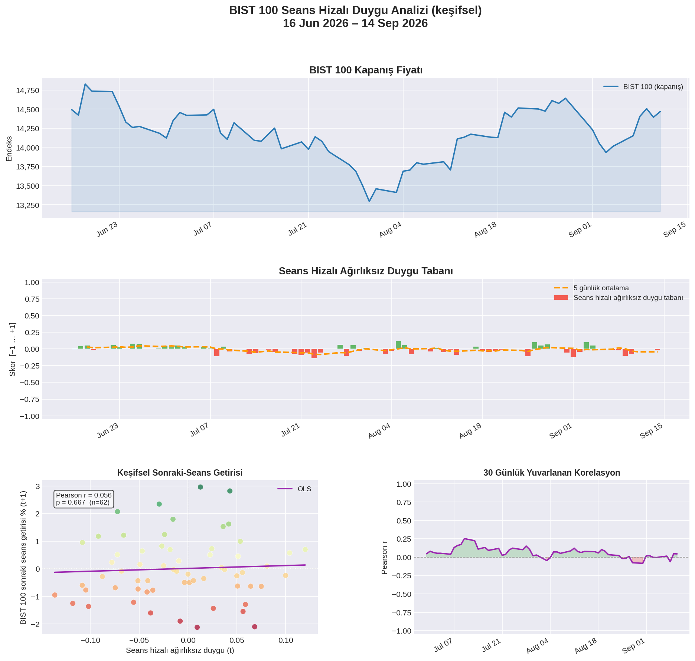
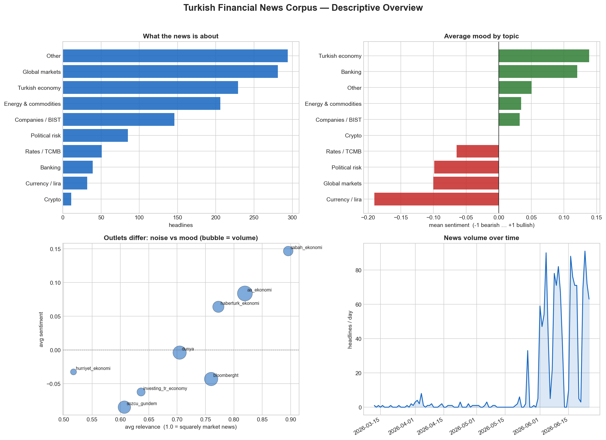
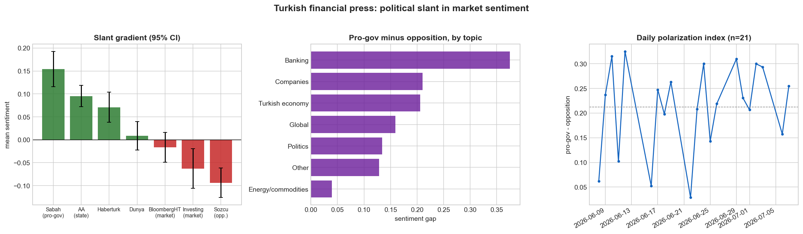
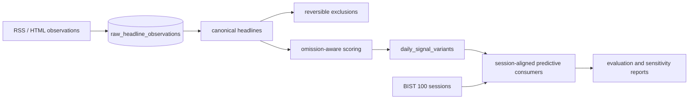

# BIST 100 Turkish News Sentiment Pipeline


-lightgrey.svg)


---

## In 60 seconds

**Problem.** Does Turkish-language financial news carry information about the
next tradable move in the BIST 100 — beyond what lagged global market factors
already explain?

**Architecture.** A daily cloud pipeline scrapes 11 Turkish outlets, scores each
headline with an LLM against a project-specific bullish/bearish rubric, aligns
it to the first Borsa Istanbul session that could *react* to it, groups
headlines into candidate events, builds timing-safe market windows, and
evaluates a frozen walk-forward protocol. State lives in a SQLite snapshot on an
orphan `data` branch; the cloud is the single writer.

**Dashboard.** One self-contained HTML file, seven sections: Data Health · News
Regime · Signal Families · Candidate Events · Market Windows · Predictive
Validation · Future Validation Status. Build it with `python main.py dashboard`.

**Major result.**

> **No evaluated news specification demonstrated reliable incremental
> out-of-sample predictive value under the pre-specified criteria in the current
> sample.**

50 independent sessions · 22 specifications fitted, 50 refused by a sample-size
gate · **0** met the pre-specified criteria. The result is frozen and immutable
([artifact](docs/frozen/walk-forward-protocol-v1.json)). A genuinely untouched
future test (`untouched_future_v1`) is now accumulating, with its outcome
sealed until a minimum sample is reached.

**No validated alpha, no trading strategy, and nothing here is investment
advice.**

---

## In 5 minutes

**Methodology.** LLM scoring at 83.3% held-out categorical agreement against a
300-headline human rubric — the question asked is whether an item is bullish or
bearish *for Turkish equities*, which is often the opposite of whether it is
good news. Two versioned taxonomies (signal families, market recap) sit beside
the frozen LLM category rather than replacing it.
→ [METHODOLOGY.md](METHODOLOGY.md), [LABELING.md](LABELING.md)

**Safeguards.** These exist because each caught something real:

| Safeguard | What it caught |
|---|---|
| Mixed-experiment aggregation refused at runtime | three days of production runs averaging two scorer identities |
| Price-bar completeness states | a mid-session snapshot stored as a close, 1.53% off with the direction inverted |
| Timing audit proving `signal_date` from records | every post-close window built one session late |
| Session-level statistical unit | 773 event rows carrying only 50 independent outcomes |
| Sample-size gate that refuses to fit | 50 specifications that would otherwise have been quoted |
| Append-only audit tables | manual review and provenance history that a rerun would have erased |

**Event layer.** Transparent rule-based grouping — shared entity, same family,
48h anchored window, title-similarity threshold — not learned similarity. Every
mapping keeps its similarity score and match rule. 94% of groups are singletons,
and nothing calls them verified events because no human has reviewed one yet.
→ [docs/EVENT_MODEL.md](docs/EVENT_MODEL.md)

**Predictive evaluation.** A protocol hashed before results were read: target,
sample, feature sets, models, folds, embargo, metrics, missing-value policy,
thresholds and success criteria all fixed in advance. Chronological folds, no
random splitting, preprocessing fitted on training folds only, baselines
re-scored on exactly the sessions each news model predicted.
→ [docs/PREDICTIVE_PROTOCOL.md](docs/PREDICTIVE_PROTOCOL.md)

**The full write-up:** [docs/RESEARCH_REPORT.md](docs/RESEARCH_REPORT.md) — 15
sections, separating descriptive findings from retrospective exploratory results
from the frozen future validation.

---

## Deep technical

| Area | Document |
|---|---|
| Complete research report | [docs/RESEARCH_REPORT.md](docs/RESEARCH_REPORT.md) |
| Methodology and design decisions | [METHODOLOGY.md](METHODOLOGY.md) |
| Component and schema reference | [DOCUMENTATION.md](DOCUMENTATION.md) |
| Timing semantics, proven from records | [docs/TIMING.md](docs/TIMING.md) |
| Frozen predictive protocol | [docs/PREDICTIVE_PROTOCOL.md](docs/PREDICTIVE_PROTOCOL.md) |
| Frozen result artifact (JSON) | [docs/frozen/](docs/frozen/) |
| Event model and market targets | [docs/EVENT_MODEL.md](docs/EVENT_MODEL.md) |
| Descriptive indicators | [docs/FINANCIAL_INDICATORS.md](docs/FINANCIAL_INDICATORS.md) |
| Test coverage by risk, with residual gaps | [docs/TEST_RISK_MAP.md](docs/TEST_RISK_MAP.md) |
| Reproducibility and credentials | [docs/REPRODUCIBILITY.md](docs/REPRODUCIBILITY.md) |
| Operations and schedules | [docs/OPERATIONS.md](docs/OPERATIONS.md) |
| Data sources | [docs/DATA_SOURCES.md](docs/DATA_SOURCES.md) |
| Labelling rubric | [LABELING.md](LABELING.md) |
| Migration history | [MIGRATION.md](MIGRATION.md) |
| Roadmap | [ROADMAP.md](ROADMAP.md) |

Two commands, neither needing a credential:

```bash
python -m scripts.demo_phase_a                        # offline demo
python -m scripts.verify_all --db finance_sentiment.db  # schema, artifacts,
                                                        # integrity, timing,
                                                        # tests, demo
```

---

This is an AI-assisted research pipeline for Turkish financial news. Its strongest contribution is the auditable collection, scoring, market-session alignment, and evaluation process - not a validated trading signal.

The repository has three separate research areas:

1. **Sentiment and relevance measurement quality** - how consistently the scorer follows the project's written human-label rubric.
2. **Media framing and polarization** - descriptive outlet-associated differences in story selection and tone.
3. **Exploratory prediction** - whether session-aligned news measurements contain information about subsequent BIST 100 returns.

The third area remains exploratory. The project has not demonstrated validated alpha, and no profitable trading strategy is claimed.

The implementation was developed with AI-assisted coding tools, while the research design, data collection, validation methodology, evaluation framework, and experimental decisions were designed and reviewed by me. Important choices, corrections, and remaining risks are documented so the work can be inspected rather than inferred from a passing test count.

For the active LLM backend, the model returns sentiment direction and model-reported sentiment intensity. Stored positive, neutral, and negative components derived from those values are **synthetic compatibility fields**, not calibrated probabilities of class membership, correctness, or statistical confidence.

## Current project status

| Item | Current state |
|---|---|
| Production scorer | OpenAI `gpt-5-mini`, prompt version `p3`; XLM-RoBERTa remains an offline fallback |
| Deterministic tests | **596 passing** across ingestion, scoring, migration, aggregation, timing, event grouping, walk-forward validation, freezing, and demo behavior |
| Processing integrity | Explicit `pending`, `scored`, `retry_pending`, and `failed` states; omitted items are retried and never fabricated as neutral |
| Raw-data handling | Source-distinct fetched observations are audited before canonical deduplication; filtering uses reversible, versioned exclusions; permanent deletion is a guarded code-level operation |
| Predictive baseline | Session-aligned `daily_signal_variants.simple_mean`; relevance-, intensity/relevance-, and full-weighted variants are retained for sensitivity analysis |
| Run health | Final `success` / `degraded` / `failed` outcome plus scrape, scoring, aggregation, market-data, and audit component states and structured diagnostics |
| Polarization inference | Raw means/effect size, date-cluster bootstrap, topic/date controls, clustered sensitivities, and separate selection/framing outputs; observational only |
| Public demo | `python -m scripts.demo_phase_a`; committed fixture, no API key, model download, private DB, or network |
| One-command verification | `python -m scripts.verify_all --db finance_sentiment.db` checks schema, frozen artifacts, integrity, timing, tests and demo outputs |
| Frozen retrospective result | `walk-forward-protocol-v1`, artifact `bfdbadb0...`, immutable and append-only; conclusion stored verbatim |
| Untouched future validation | `untouched_future_v1` accumulating from reaction session 2026-08-10; outcome sealed until 51 sessions and 120 days |
| Operating mode | **Maintenance and untouched-data accumulation** since 2026-08-08. No new predictive features, models, targets, thresholds, control sets, grouping rules or validation criteria without a new versioned research project. See [docs/OPERATIONS.md](docs/OPERATIONS.md) |
| Current automation | GitHub Actions on weekdays at 06:30 UTC (09:30 Istanbul); the SQLite snapshot is persisted on the `data` branch |
| Sample snapshots | Local checked-in DB: 2026-03-12 through 2026-07-07; latest known `origin/data` snapshot: 2026-07-31. Counts are intentionally omitted because the automated snapshot continues to change |
| Last methodology update | 2026-08-01 (processing integrity, session variants/alignment, polarization inference, and public demo); scorer prompt `p3` last changed 2026-06-13 |
| Predictive status | Evaluated out-of-sample under a frozen, hashed protocol (`docs/PREDICTIVE_PROTOCOL.md`) and **null**: no news feature set beat its baselines by the pre-specified margins. Labelled retrospective walk-forward exploration, not an untouched future test. No strategy and no transaction-cost evaluation |
| Timing convention | `signal_date` is the first trading session able to react, proven against 3 893 production records (`docs/TIMING.md`), not assumed from tests |
| Event-level migration | Headline aggregation remains primary; event dual-write is enabled, phases 0-2 are built, KAP ingestion is disabled pending production access, and later event-centric phases are pending |

The schema changes are additive. Initializing an existing database adds and backfills metadata where possible; it does not silently re-score headlines, recompute aggregates, or regenerate dated findings and figures. Derived signal tables change only when aggregation is explicitly run, including through commands such as `run`, `aggregate`, `clean`, `restore-exclusion`, or LLM recategorization that deliberately invoke it.



*Checked-in research-output snapshot. Current chart generation uses the session-aligned unweighted baseline; this historical artifact is not silently regenerated by schema initialization. Crossing the display gate permits exploratory reporting only and does not validate a relationship.*

---

## The research question, and why it is hard

The hypothesis sounds simple: positive news today -> market up next session. It is genuinely difficult to test honestly:

- **Markets are roughly efficient.** By the time news is public, prices may already reflect it.
- **Causality runs both ways.** Sentiment may react to prices rather than lead them.
- **Daily frequency is noisy.** With one observation per trading session, a small effect is buried under everything else moving the market.

The null hypothesis is **no signal**. The pipeline is designed to test it fairly, with safeguards against look-ahead, silent missing-data substitution, and misleading date alignment.

## What I decided, and why

**1. Benchmark before believing a model.** The first scorer, a Twitter-trained multilingual XLM-RoBERTa model, showed 76.8% agreement with the project's human-label rubric on labels also used to tune its thresholds. A held-out comparison of XLM-RoBERTa, Gemini, and gpt-5-mini led to the current scorer. Prompt `p3` shows **83.3% categorical agreement** on the 270 held-out canonical labels. This measures agreement with one project's rubric, not objective truth, predictive power, or model confidence.

**2. Preserve observations and make filtering reversible.** An early AI-assisted cleanup deleted headlines it judged irrelevant. I overruled that design and restored the affected rows from backup. The current ingestion path records source-distinct fetched observations and filter metadata before canonical deduplication. Keyword and low-LLM-relevance decisions create versioned exclusion-history rows; restoration timestamps the decision rather than erasing it. `clean` now excludes and re-aggregates. Permanent canonical-row deletion is available only through a direct database call with `confirm=True`, and raw observation rows survive with their link cleared.

**3. Separate the baseline from weighting assumptions.** The primary predictive signal is now the arithmetic `simple_mean`. The session table also stores relevance-weighted, intensity-and-relevance-weighted, and legacy full-weighted variants. The full variant uses `max(abs(score), 0.10) * relevance * time_weight` under the current neutral source/category defaults. These are sensitivity specifications, not calibrated probability or confidence adjustments, and no preferred variant is selected from the evaluation sample. Its `event_count` is only the number of distinct bridge-linked event records present in the input, not a count of independently resolved real-world events.

**4. Align news to when the market can react.** Publication timestamps are normalized to Europe/Istanbul and classified as `pre_open`, `during_session`, `post_close`, `weekend_or_holiday`, or `unknown`. Pre-open and in-session news maps to that trading session; post-close, non-trading-day, and unknown-time news rolls forward conservatively. The assignment is versioned and observes configured full holidays and half-day closes.

**5. Keep processing failure distinct from neutral judgment.** A model result is stored only when an item is explicitly returned and validated. Missing or invalidated IDs remain NULL, move through configurable item-level retries, and end in `failed` after the configured attempt cap. An explicit zero-score neutral response remains a valid `scored` observation. Only complete `scored` rows without active exclusions enter aggregates, and multiple eligible experiment identities are blocked from aggregation unless the operator supplies an explicit override.

**6. Refuse to over-interpret.** Signal statistics are hidden until 30 eligible overlapping observations exist. Crossing that gate only permits **exploratory reporting**; it does not make an estimate reliable or validate a strategy. Next-session returns are formed on the complete ordered market-price series before signals are joined.

**7. Trust the source, not just the words.** The project is mid-migration from treating the headline as the unit of analysis to treating the event as the unit, with source-quality tiers and a planned official-disclosure path. Event dual-write remains a research bridge; it is not yet the production unit of aggregation.

**8. Do not run a daily job on a laptop.** The project moved from Windows Task Scheduler to GitHub Actions, with the database persisted on a dedicated data branch.

## Quality checks and corrections

These are real mistakes surfaced during development:

- **Returns were shifted after filtering.** Some supposed next-session pairs were actually 2-15 sessions apart. The fix computes the lead on the complete price series before joining sparse signals, and regression tests now cover the predictive consumers.
- **One source was repeatedly counted.** NULL URLs do not collide under SQLite uniqueness. Source/title/date deduplication and the raw-observation audit now distinguish replay from genuine cross-source observation.
- **Missing model items became neutral.** The scorer contract now returns only explicit valid IDs. Missing-only retries preserve NULLs, and exhausted items become `failed` rather than neutral.
- **The AI deleted data.** The affected rows were restored from backup. Scrape and cleanup decisions are now recorded as reversible exclusions, while permanent deletion requires explicit confirmation.
- **A model version tag was sent as an API model name.** The run failed loudly; request identity and stored provenance were separated.
- **Human labels drifted.** A later labeling round had a substantially different neutral share. The project added intra-annotator consistency tooling so model agreement can be read against the stability of the reference labels.
- **Tests had calendar expiry dates.** Affected tests now use stable fixtures or dates relative to today.

The recurring theme is that backups, loud failure states, held-out validation, and explicit audit metadata are what make fast iteration inspectable.

## What the project can currently support

- Prompt `p3` reached **83.3% categorical agreement with the project's human-label rubric** on 270 held-out labels; the 0.25 relevance cutoff reached **90.7% agreement** with 300 human keep/drop judgments.
- These measurements assess the project's annotation convention. They are not probabilities of correctness and say nothing about return prediction.
- The predictive work remains exploratory even after its reporting gate. Any future claim still needs chronological out-of-sample evaluation, controls, costs, and multiple-testing discipline.
- The four stored variants can be compared with the sensitivity command, but the command deliberately reports no preferred specification.

The central contribution is the evaluation discipline around the model: explicit labeling conventions, provenance, omission-aware processing, reversible exclusions, versioned session alignment, simple baselines, and visible residual risks.

## Reading the news, not just scoring it

A single daily average hides the thing a reader actually wants to know. A rate decision and a company earnings release reach a portfolio through different channels, so averaging them into one number discards exactly the structure that would make the series useful. The descriptive layer separates those channels and asks four different questions about each of them.

Headlines are grouped into economically distinct **signal families** — monetary policy, inflation and macro, political and regulatory risk, currency, banking sector, named-issuer events, global risk, market recap, media narrative, and other. The grouping is derived from the frozen scoring category plus transparent Turkish headline rules, and carries its own version, so the economics can be revised without redefining what was measured. Where the rules cannot decide, the headline is reported as ambiguous rather than quietly forced into a bucket.

The banking split is worth stating precisely, because it is easy to get wrong: the boundary is **entity specificity, not industry**. "Banking sector loan growth slows" is sector news; "Garanti BBVA announced results" is a named issuer's own disclosure, treated exactly like any other company's. Keying on whether a specific listed entity is named makes the rule work the same way in every sector instead of carving out a special case for banks.

**Market recaps are identified and set aside.** A headline saying the index closed lower reports what the market did, not what it learned. Leaving those in a directional signal builds a reverse-causality trap: the tone follows the return by construction, so any apparent predictive relationship is the return predicting itself. They are kept — they measure attention, and they are the right sample for reverse-causality checks — but excluded by default from directional work.

For each family and session the pipeline reports four separate things, because conflating them is how descriptive statistics start sounding like forecasts:

| | |
|---|---|
| **Level** | where tone sits now |
| **Change** | how it moved over 5 and 20 sessions |
| **Abnormal** | where it sits against *its own* prior history |
| **Attention** | how much coverage, from how many independent outlets |

The abnormal measure is the one that required the most care. An outlet's absolute tone says little, since some papers are structurally gloomier than others — the same −0.2 is unremarkable from one and notable from another. So each outlet and family is normalized against its own rolling history, and **every value uses only observations strictly before the day it describes.** A full-sample mean would leak the future into every historical value and quietly invalidate any evaluation built on top of it.

Two smaller distinctions carry real weight. Disagreement measures variation *among news sources* — it is not market uncertainty, and is never described as such. And ten copies of one wire story is one event covered widely, not ten independent signals, so headline count, event count and outlet breadth are counted and named separately.

Throughout, a value that cannot be defensibly computed is reported as **NULL rather than zero**. A zero mean reads as "the news was neutral"; the truth is often "there were two headlines from one outlet", and those are different claims.

None of this is a trading signal, and none of it has been evaluated out-of-sample. The predictive result remains exploratory and null. Detail in [docs/FINANCIAL_INDICATORS.md](docs/FINANCIAL_INDICATORS.md).

## What the news itself looks like

The corpus supports descriptive analysis (`analyze_corpus.py`). Checked-in findings are dated snapshots rather than automatically current totals:



- **Currency/lira news skews most bearish** in the documented snapshot, while Turkish-economy news skews most bullish.
- **Outlets show systematic tone differences.** These are outlet-associated descriptive patterns, not causal estimates of political bias.
- Emerging-markets, oil, and USD/TRY context series are collected so future work can separate Turkey-specific movement from broad market movement.

### Headline finding - an outlet-associated tone difference



The maintained July snapshot shows a standardized outlet-associated difference of **Cohen's d = 0.74**, with dependence-aware date-cluster bootstrap uncertainty for the raw gap of roughly **0.19 to 0.24**. The underlying outlet means are **+0.11** for pro-government/state outlets and **-0.09** for the sampled opposition outlet(s), a descriptive gap of **+0.20**. Headlines share dates, outlets, and stories, so the analysis leads with clustered uncertainty and diagnostics rather than the naive unclustered *p*-value. Same-story comparisons suggest selection contributes substantially to the aggregate difference, while same-event framing is less precisely estimated because verified shared-event coverage is limited. These are historical, observational snapshot results—not a causal political-bias claim. See the [dated findings](docs/polarization_findings.md) and the maintained [dependence-aware methods](docs/POLARIZATION_METHODS.md).

## Run it

```bash
git clone https://github.com/amirremirr/Turkish-stock-market-sentiment-analysis.git
cd Turkish-stock-market-sentiment-analysis

python -m pip install -r requirements-cloud.txt
python -m scripts.demo --output-dir demo_output
```

That path is fully offline after dependency installation. For a live pipeline run,
copy `.env.example` to `.env`, supply the required provider credentials, and then
run `run.bat run`. The optional local XLM-R scoring fallback requires the larger
`requirements.txt` environment and `SENTIMENT_BACKEND="xlmr"`.
The pipeline also runs unattended every weekday in GitHub Actions;
`pull-cloud-db.bat` retrieves the latest data-branch snapshot.

Useful commands (`run.bat <cmd>` or `python main.py <cmd>`):

| Command | What it does |
|---|---|
| `run [--allow-mixed-experiments]` | Full pipeline end to end; the named override persists aggregation/final status as degraded when identities mix |
| `status` / `dashboard` | Database health and a self-contained HTML dashboard |
| `score` | Score eligible `pending` / `retry_pending` rows with omission-aware retries |
| `aggregate [--allow-mixed-experiments]` | Explicitly rebuild derived tables; mixed experiment IDs block by default and require the named override |
| `clean [--dry-run]` | Preview or store reversible off-topic exclusions; no raw row deletion |
| `restore-exclusion ID` | Restore one active exclusion and rebuild aggregates |
| `relabel` | Re-derive labels from stored backend-specific components |
| `recategorize --llm` | Refresh category and relevance, reconcile exclusions, and aggregate |
| `export-labels --n 300 [--uncertain]` | Export headlines for human labeling |
| `validate-labels <csv>` | Rubric agreement and confusion-matrix report |
| `kap-ingest --dry-run` | Validate the KAP Tier-A integration without enabling production ingest |
| `run.bat test` | Run the regression suite without downloading a model |

Run the four-variant exploratory sensitivity report with:

```bash
python main.py aggregate --db finance_sentiment.db
python -m analysis.prediction.sensitivity --db finance_sentiment.db --output outputs/signal_sensitivity.json
```

`python evaluate.py` runs the read-only quality report. Its 30-observation threshold controls reporting only; it does not certify reliability.

Run the observational selection-versus-framing report without changing an
artifact:

```bash
python -m analysis.polarization.inference --db finance_sentiment.db
```

Run the fully offline public demo (no key, model download, private database, or
network request):

```bash
python -m scripts.demo --output-dir demo_output
```

It writes `signal_results.csv`, `audit.json`, and `signal_variants.png`.

## Architecture


```mermaid
flowchart LR
    A[RSS / HTML observations] --> B[(raw_headline_observations)]
    B --> C[canonical headlines]
    C --> X[reversible exclusions]
    C --> D[omission-aware scoring]
    D --> E[daily_signal_variants]
    E --> F[session-aligned predictive consumers]
    G[BIST 100 sessions] --> F
    F --> H[evaluation and sensitivity reports]
```

Key modules:

```text
config.py                    Tunable feeds, thresholds, retry limits, and calendar data
scraper.py                   Source-scoped observation collection and filter metadata
sentiment_llm.py             Partial-result-aware gpt-5-mini scorer
sentiment.py                 XLM-RoBERTa offline fallback
database.py                  Additive schema, state transitions, exclusions, and audit queries
pipeline.py                  Component orchestration and run outcomes
trading_calendar.py          Timestamp normalization, timing buckets, and session assignment
aggregation/signals.py       Pure four-variant aggregation formulas
analysis/prediction/sensitivity.py  Equal-footing variant report
analysis/polarization/inference.py  Dependence-aware selection/framing report
scripts/demo.py               Deterministic API-key-free public demo
visualize.py / dashboard.py  Session-baseline research outputs
evaluate.py                  Read-only quality and exploratory signal audit
events_bridge.py             Headline-to-event research bridge
kap_ingest.py                Disabled-by-default KAP integration
```

Documentation: [methodology](METHODOLOGY.md) | [technical reference](DOCUMENTATION.md) | [polarization methods](docs/POLARIZATION_METHODS.md) | [repository structure](docs/REPOSITORY_STRUCTURE.md) | [labeling rubric](LABELING.md) | [AI assistance](AI_ASSISTANCE.md) | [test-to-risk map](docs/TEST_RISK_MAP.md) | [event migration](MIGRATION.md) | [roadmap](ROADMAP.md)

## Future work

- Expand annotation with multiple independent human annotators and formal inter-annotator agreement.
- Replace lexical framing candidates with verified repeated canonical events as event resolution matures.
- Continue the event-centric migration without replacing the headline baseline until it wins pre-specified out-of-sample tests.
- Use chronological walk-forward evaluation, costs, controls, and independent windows as the market-history sample grows.
- Never choose a signal variant on the same sample used to evaluate it.

## License

MIT - see [LICENSE](LICENSE).
