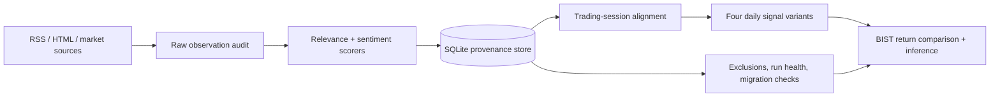

# Turkish Financial-News Sentiment Research

[](requirements-cloud.txt)
[](docs/TEST_RISK_MAP.md)
[](.github/workflows/daily.yml)
[](LICENSE)

An auditable research-engineering system that collects Turkish financial news, scores its market relevance and sentiment, aligns each headline to the first BIST session able to react, and examines its relationship with BIST 100 returns. The project was developed with substantial AI-assisted coding and human-directed research design, validation, and review.

**Research status:** reproducible and extensively tested, but still exploratory: this project does not claim validated alpha or a profitable trading strategy.

## Why this project matters

- Turkish financial news is fragmented across outlets, highly context-dependent, and difficult to measure consistently.
- A timestamp mapped to the wrong BIST session can invalidate an otherwise careful predictive study.
- Agreement with a sentiment rubric is a measurement result; it does not automatically imply market predictability.

## What I built

```text
News collection → relevance and sentiment scoring → market-session alignment
→ daily signal variants → BIST 100 return comparison → quality audit
```

The current workflow runs end to end and remains inspectable at each stage:

- Source observations are preserved in SQLite before canonical deduplication, with reversible exclusions rather than silent deletion.
- Every score records scorer, prompt/model, component kind, and experiment provenance; mixed experiment identities are blocked by default.
- Publication times are normalized to Europe/Istanbul and assigned to the first trading session able to react.
- Four daily variants are retained for sensitivity analysis instead of selecting a preferred specification after seeing results.
- GitHub Actions runs the cloud pipeline on weekdays, while an offline demo reproduces the mechanics without an API key, model download, private database, or network.

## Key verified results

| Evidence | Result | What it means |
|---|---:|---|
| Held-out categorical agreement | **83.3%** | Agreement with the project’s human-label rubric, not objective truth or return prediction |
| Held-out relevance agreement | **90.7%** | Agreement with human keep/drop judgments |
| Deterministic test suite | **201 passing** | Current regression coverage across ingestion, scoring, migration, aggregation, inference, and demo behavior |
| Stored daily signal variants | **4** | Simple mean plus weighted sensitivity specifications; no preferred variant is claimed |
| Predictive status | **Exploratory** | No validated alpha, out-of-sample strategy, or profitability claim |

## Research outputs

### Measurement quality

The active scorer’s `p3` prompt reaches 83.3% categorical agreement on 270 held-out canonical labels. The relevance cutoff reaches 90.7% agreement on 300 held-out keep/drop judgments. These are rubric-consistency checks: they show how closely the scorer follows a documented annotation convention, not calibrated probabilities, causal truth, or evidence of a trading edge.

### Media framing

The polarization analysis reports an outlet-associated tone difference with effect size and dependence-aware uncertainty first. In the maintained snapshot, the standardized difference is approximately **Cohen’s d = 0.74**, with a date-cluster bootstrap interval for the raw gap of roughly **0.19 to 0.24**. Much of the overall difference appears to come from story selection—different outlets choosing to cover different developments. Evidence that outlets frame the exact same event differently is currently less precise because reliably matched shared stories remain limited. These are observational associations, not causal claims about political bias. See the [dated findings](docs/polarization_findings.md) and [polarization methods](docs/POLARIZATION_METHODS.md).

### Market prediction

The market comparison remains exploratory. A credible predictive result would require more chronological out-of-sample observations, market and macro controls, robustness to experiment choice, and transaction-cost evaluation. The reporting gate and four stored variants make the current evidence inspectable; they do not turn it into a validated strategy.

## Architecture


```mermaid
flowchart LR
    A[RSS / HTML / market sources] --> B[Raw observation audit]
    B --> C[Relevance + sentiment scorers]
    C --> D[(SQLite provenance store)]
    D --> E[Trading-session alignment]
    E --> F[Four daily signal variants]
    F --> G[BIST return comparison + inference]
    D --> H[Exclusions, run health, migration checks]
    H --> G
```

SQLite is the durable audit boundary: raw observations, score provenance, exclusions, session assignments, component states, and derived signals remain queryable. GitHub Actions provides scheduled execution; tests protect the contracts at each boundary.

## Built for auditability

- Missing model responses remain missing and are retried; they are never converted into neutral sentiment.
- Headlines are aligned to the first BIST session able to react, and mixed scorer experiments are blocked by default.
- Raw observations, exclusions, scorer provenance, migrations, and derived signals remain inspectable in SQLite.

See the [methodology](METHODOLOGY.md), [technical documentation](DOCUMENTATION.md), and [test-risk map](docs/TEST_RISK_MAP.md) for implementation detail.

## Run the public demo

```bash
git clone https://github.com/amirremirr/Turkish-stock-market-sentiment-analysis.git
cd Turkish-stock-market-sentiment-analysis
python -m pip install -r requirements-cloud.txt
python -m scripts.demo --output-dir demo_output
```

The command is offline and deterministic. It produces:

- `signal_results.csv`
- `audit.json`
- `signal_variants.png`

## Technical stack

Python, SQLite, OpenAI API, XLM-RoBERTa fallback, pandas, statsmodels, matplotlib, pytest, and GitHub Actions.

## Repository guide

- [`scripts/demo.py`](scripts/demo.py): public offline reproducibility path.
- [`analysis/`](analysis): signal sensitivity, evaluation, and polarization inference.
- [`pipeline.py`](pipeline.py), [`database.py`](database.py): orchestration, persistence, provenance, and migration-safe storage.
- [`tests/`](tests): deterministic contract and integration tests.
- [`METHODOLOGY.md`](METHODOLOGY.md), [`DOCUMENTATION.md`](DOCUMENTATION.md): research and technical decisions.
- [`docs/`](docs): dated findings, methods, test-risk map, and checked-in snapshots.

## Limitations

- The daily market sample remains limited for predictive inference.
- Headline sentiment is not an expectation-relative measure of economic surprise.
- Event resolution is incomplete; `event_count` currently means bridge-linked event records, not independently resolved real-world events.
- Polarization findings are observational and sensitive to source selection and shared-story coverage.
- No validated trading strategy or profitability claim is made.

## Documentation

- [Methodology](METHODOLOGY.md)
- [Technical documentation](DOCUMENTATION.md)
- [AI assistance and review record](AI_ASSISTANCE.md)
- [Labeling rubric](LABELING.md)
- [Test-risk map](docs/TEST_RISK_MAP.md)
- [Polarization methods](docs/POLARIZATION_METHODS.md)
- [Roadmap](ROADMAP.md)
