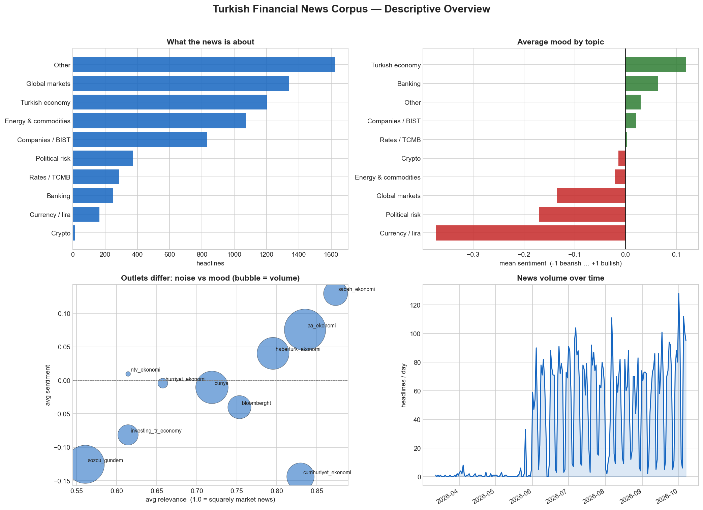

# News corpus — descriptive findings

> **Dated research snapshot — generated 2026-10-08** from the `origin/data`
> snapshot of 2026-10-07. The figures describe that database, not live totals.

Auto-generated by `analyze_corpus.py` (exploratory description, not prediction).
This descriptive snapshot does not establish causality, calibrated model
correctness, or return predictability.

- **7,158 scored headlines** span 2026-03-12 to 2026-10-07 (11 sources, 10 topics).
- Most-covered topic: **Other** (23%); least: Crypto.
- Most *bearish* topic on average: **Currency / lira** (-0.37); most *bullish*: **Turkish economy** (+0.12).
- Outlets differ markedly: **sozcu_gundem** is the noisiest (avg relevance 0.56), **sabah_ekonomi** the most on-topic (0.87).
- Most-bearish outlet: **cumhuriyet_ekonomi** (-0.14); most-bullish: **sabah_ekonomi** (+0.13).

