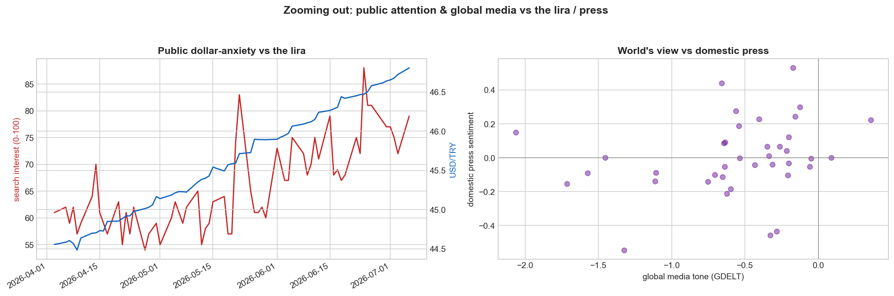

# Zoom-out data: public attention & global media

*Two new "different-vantage" data sources, connected to the market, the domestic
press, and the media-polarization index. Scripts: `fetch_gtrends.py`,
`fetch_gdelt.py`, `analyze_external.py`.*

## What was added

- **Google Trends** (public attention): daily Turkey search interest for *dolar,
  enflasyon, kriz, zam, faiz* — what the public is anxious about, independent of
  the (politically biased) press. 128 days.
- **GDELT** (the world's media view): daily average media *tone* and article
  *volume* about Turkey's economy across global news. Mean tone **−1.1**
  (negative coverage). 125 days.

Both persist in `external_series` and grow as re-fetched.

## What we found — and it's mostly a methodology lesson

**Nothing survives an honest test.** On *changes* (not levels) and after FDR
correction on the trading-day-aligned sample, no relationship holds:

- Two "significant" results appear if you correlate **levels**: dolar-search vs
  the lira (r=0.75) and GDELT tone vs the lira (r=0.48). **Both are common-trend
  artifacts** — the series drift together over the period. On *changes*, the
  GDELT one vanishes entirely (r≈0, p=0.94). Correlating trending levels lies.
- A dolar-search → **next-day** lira lead looked marginal in one loose framing
  (r=0.21, p=0.046, n=95) but weakened to **r=0.13 (n.s.)** under proper
  trading-day alignment and did not survive FDR. Treat as noise, not a signal —
  same failure mode as the earlier FX false positive.

## What is genuinely real (descriptive, not predictive)

- Public **dolar-search co-moves with the lira** contemporaneously — attention
  tracks the exchange rate (expected, but validates the data).
- Global media tone on Turkey is **persistently negative** and, weakly, agrees
  in direction with domestic press sentiment (r≈0.25, n.s.).

## Value delivered

New descriptive lenses (public attention, global tone) now collected and
accumulating; a clean, documented demonstration of the **trend-correlation
trap**; and — importantly — the discipline held: two seductive level-correlations
and one fragile predictive lead were all correctly *not* reported as findings.
Markets remain unpredicted at this sample; the zoom-out data grows the surface
area for when there's enough of it.
