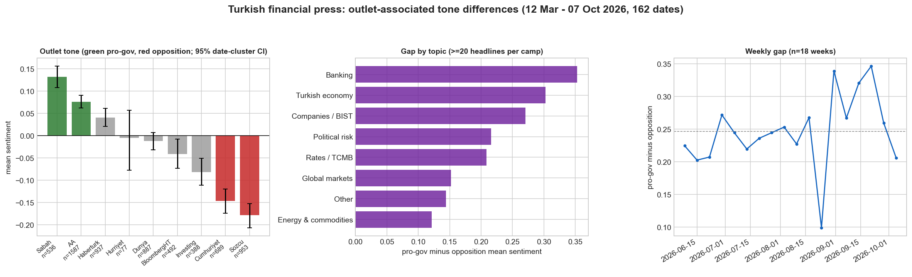
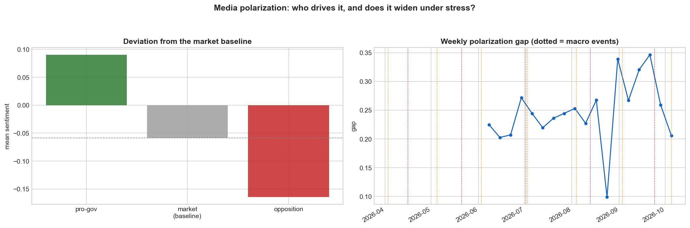

# Finding: political slant in Turkish financial-news sentiment

## October 2026 update (current)

*Data: `origin/data` snapshot of 2026-10-07; 3,765 camp headlines over 130
publication dates (2026-03-12 .. 2026-10-07). Rows come from
`analysis.polarization.inference.load_headlines`: scored, not excluded by the
relevance filter, one row per outlet per headline. Figure:
`python -m analysis.polarization.figure`; numbers:
`python polarization_analysis.py`.*

The slant has **persisted and widened** since the July snapshot, and now rests
on two opposition papers rather than one:

| Camp | Outlet | n | Mean sentiment |
|---|---|---|---|
| Pro-government / state | Sabah | 536 | +0.13 |
| | Anadolu Agency | 1,587 | +0.08 |
| Opposition | Cumhuriyet | 689 | −0.15 |
| | Sözcü | 953 | −0.18 |

Pro-government minus opposition: **+0.255**, date-cluster 95% CI
**[+0.234, +0.274]**, Cohen's d = 0.81; with topic and date fixed effects the camp
coefficient is +0.21. (July: +0.20, d = 0.74, Sözcü only.) Cumhuriyet on its own
sits well below every non-opposition outlet, so the opposition result is no
longer one paper's house style.

The topic structure also held. The gap is largest on politically loaded
domestic topics and smallest on ones Ankara does not control:

| Topic | Gap | n (pro / opp) |
|---|---|---|
| Banking | +0.35 | 65 / 96 |
| Turkish economy | +0.30 | 555 / 235 |
| Companies / BIST | +0.27 | 301 / 189 |
| Political risk | +0.22 | 35 / 224 |
| Rates / TCMB | +0.21 | 90 / 72 |
| Global markets | +0.15 | 317 / 228 |
| Other | +0.14 | 419 / 185 |
| Energy & commodities | +0.12 | 329 / 314 |

Energy and commodities still has the smallest gap, but it is no longer near
zero (July: +0.04), so "outlets agree about oil" is now "outlets disagree least
about oil".

**Selection vs framing** is unchanged in spirit: on 224 lexically matched
cross-camp pairs the mean gap is +0.15, but the median is 0 and only 49% of
pairs lean pro-government. Those pairs are unverified matches, a sensitivity
check rather than evidence of framing.

**Measurement correction.** Sözcü's `ekonomi` and `gundem` RSS feeds serve
identical items. Before 2026-10-08 the loader counted each such headline once
per feed, so about 480 Sözcü headlines entered the opposition camp twice. The
loader now counts one row per outlet; the gap moved from +0.264 to +0.255.

*The July snapshot below is kept as originally written, for the record.*

## July 2026 snapshot (historical)

*Generated from `polarization_analysis.py`. Data: ~1,900 scored headlines,
2026-03 to 2026-07.*

## The result

Turkish financial-news sentiment carries a **large, statistically overwhelming
political slant**. Ranking outlets by political leaning produces a monotonic
gradient in average market sentiment:

| Camp | Outlets | Mean sentiment |
|---|---|---|
| Pro-government / state | Sabah, Anadolu Agency | **+0.11** |
| Market-focused | Bloomberg HT, Investing | −0.03 |
| Opposition | Sözcü | **−0.09** |

The pro-government vs opposition gap is **+0.20** (t = 10.6, **p ≈ 4×10⁻²⁴**,
Cohen's d = 0.74 — a medium-to-large effect on ~950 headlines). Unlike the
market-prediction question, this finding is **not** sample-limited: it has real
statistical power and the 95% confidence intervals for the two camps do not
overlap.

## What makes it non-obvious: the slant is *political*, not tonal

The divergence is concentrated in **domestic-economic coverage** and nearly
disappears on topics Ankara does not control:

| Topic | Pro-gov − opposition gap |
|---|---|
| Turkish economy (macro) | **+0.21** |
| Companies | +0.21 |
| Global markets | +0.16 |
| **Energy / commodities** | **+0.04** |

Outlets split sharply on *how the Turkish economy is doing* (a politically
loaded question) but essentially **agree about oil and commodity prices**. If
this were a blanket editorial mood, the gap would appear everywhere; instead it
tracks the political charge of the topic. That within-topic contrast is the
evidence the mechanism is political.

## Exploratory (thin data, not yet a claim)

- **Daily polarization index** (pro-gov − opposition, n≈21 days): consistently
  positive (+0.21), with spikes around the mid-June 2026 political-tension days.
- **Market link:** polarization → next-day lira volatility is currently null
  (r≈+0.09, p≈0.71, n≈19) — underpowered. Now that USD/TRY is collected daily,
  this is instrumented to be tested properly at 60+ overlap days.

## Deeper: who drives the slant (`polarization_dynamics.py`)

*Updated 2026-10-08, same rows as the October update above. Intervals resample
whole publication dates and resample the baseline together with the camps.*

Taking the **market-focused press as a neutral midpoint** (Bloomberg HT,
Investing; mean −0.06, n = 880):

| Camp | n | Mean | Deviation from market baseline (95% CI) |
|---|---|---|---|
| Pro-government | 2,123 | +0.09 | +0.15 [+0.12, +0.18] |
| Opposition | 1,642 | −0.17 | −0.11 [−0.14, −0.08] |

**Both camps sit clearly away from the market press, and neither side
measurably dominates.** The pro-government deviation is larger in point terms
(asymmetry +0.043), but the 95% CI [−0.008, +0.097] includes zero.

*Correction.* A July draft, and a version committed on 2026-10-07, said the
slant was driven mainly by pro-government optimism (asymmetry +0.068, CI
excluding zero). That version read the headlines table directly, so it included
relevance-excluded headlines and lacked the outlet de-duplication. On the
maintained rows the asymmetry is not distinguishable from zero. The claim is
withdrawn.

**Stress hypothesis: not supported.** Does the gap widen in weeks the lira
weakens? Over 18 weeks with at least 5 headlines per camp, Pearson r = +0.68
looks like a yes, but it rests on two adjacent weeks (24 Aug: smallest gap,
lira firmer; 31 Aug: large gap, largest depreciation). The rank correlation is
ρ = +0.21 (p = 0.39). No reliable relationship at this sample size. The
public-anxiety (Google Trends) leg could not run: `external_series` holds no
`gt_dolar` rows.

## Limitations and how they're being addressed

| Limitation | Status |
|---|---|
| "Opposition" was a single outlet (Sözcü) | **Resolved (October update).** Cumhuriyet now contributes 689 headlines and sits at −0.15 on its own. Sözcü's economy feed turned out to duplicate its gundem feed and adds no independent outlet. |
| Sentiment is one LLM's measure | **Addressed.** Replicated with an independent model (`replicate_slant.py`): on the same 150+150 headlines, Gemini finds gap **+0.16** vs gpt-5-mini's **+0.20** (both *p* < 1e-7), and the two models agree headline-by-headline (*r* = 0.74). The slant is in the text, not one scorer's artifact. |
| Framing vs selection (same story spun differently, or different stories covered?) | **Examined — and it complicates the story.** A same-story matcher (`same_story_analysis.py`) found 33 cross-camp pairs about the same event; *within* those pairs the gap shrinks to **+0.08 and is not significant** (p=0.12). So a large share of the overall slant appears to be **selection** (which stories each camp covers) rather than **framing** (spinning the same story). Framing is present on genuine matches (e.g. a Bosphorus transit-fee rise: pro-gov +0.30 vs opposition −0.30) but the crude lexical matcher is noisy; cleanly decomposing selection vs framing needs entity/event linking (migration Phase 6). **The robust claim is the *existence and topic-structure* of the slant, not that it is primarily framing bias.** |
